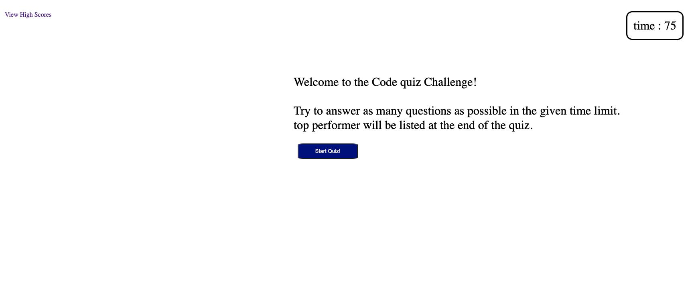
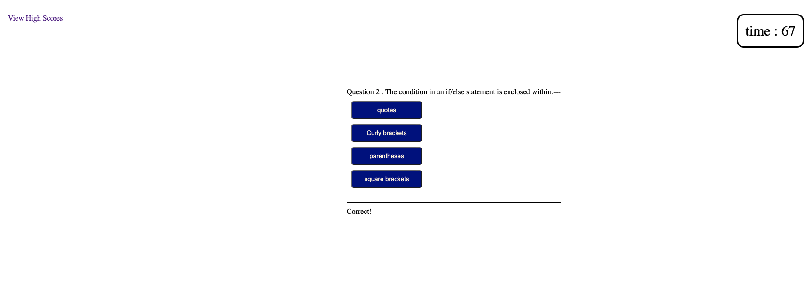

# code-quiz
Page link : https://mtugrulavci.github.io/code-quiz/

## Application Description
Application brings question in a given time and switches the question evry time user click on a question. If the question is wrong then it reduces 6 seconds from the timer, at the end of the quiz it gives remaining time as a score. The results are stored in the local storage and it shows the highest 5 result.

  
  
  
  